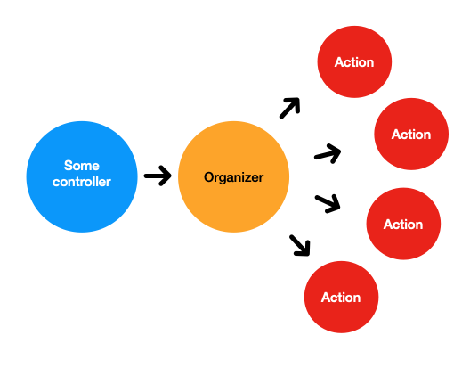
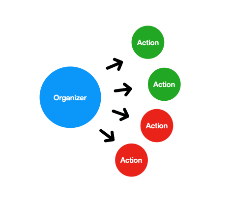
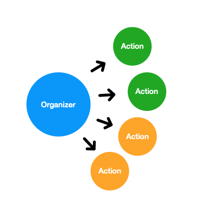

# LightService-PHP:

A service object framework heavily, heavily, heavily inspired by the [LightService](https://github.com/adomokos/light-service) Ruby gem.

This package ports over most of the awesome ideas in [LightService](https://github.com/adomokos/light-service) so that one can use it in PHP. If you're familiar with the Ruby version, then you should feel mostly at home with this package.

Be sure to check out the original [LightService](https://github.com/adomokos/light-service) if you ever find yourself in Ruby-land!

## Table of Content

- [Why LightService?](#why-lightservice)
- [How it works](#how-it-works)
- [Let's build something!](#lets-build-something)
- [Getting Started](#getting-started)
  - [Requirements](#requirements)
  - [Installation](#installation)

## Why LightService?

What do you think of this code?

```php
class TaxController extends SomeController {
  public function update {
    $order = Order::find(request('id'));
    $tax_ranges = TaxRange::for_region($order->region);

    if (is_null($tax_ranges)) {
      return ...; // render some view
    }

    $tax_percentage = $tax_ranges->for_total($order->total);

    if (is_null($tax_percentage)) {
      return ...; // render some other view
    }

    $order->tax = round(($order->total * ($tax_percentage/100)), 2);

    if ($order->total_with_tax > 200) {
      $order->provide_free_shipping;
    }

    return ...; // Redirect to some view with a flash message
  }
}
```

This controller violates the [SRP](http://en.wikipedia.org/wiki/Single_responsibility_principle). Can you imagine testing something like this?

In this instance we have a fairly simple controller, but one shudders to think what controllers could look like in more complex codebases out there in the wild.

You could argue that you could clean up this controller by moving the `$tax_percentage` logic and calculations into a tax model, but then you'll be relying on heavy model logic.

If you've ever done debugging (haha, who hasn't?) you might find it difficult to determine what's going on and where you need to start. This is especially difficult when you have a high level overview of what the code does and what needs to happen to resolve your bug.

Wouldn't it be nice if your code was broken up into smaller pieces which tell you exactly what they do?

In the case with our controller above, it would be great if our code dispelled any confusion by telling us that it was doing 3 simple things in a specific sequence whenever an order is updated:

1. Looking up the tax percentage based on order total.
2. Calculating the order tax.
3. Providing free shipping if the total with tax is greater than \$200.

If you've ever felt the headache of fat controllers, difficult code to reason about, or seemingly endless rabbit holes, then this is where LightService comes in.

## How LightService works in 60 seconds:

There are 2 key things to know about when working with LightService:

1. Actions.
2. Organizers.

**Actions** are the building blocks of getting stuff done in LightService. Actions focus on doing one thing really well. They can be executed on their own, but you'll often seem them bundled together with other actions inside Organizers.

**Organizers** group multiple actions together to complete some task. Organizers consist of at least one action. Organizers execute actions in a set order, one at a time. Organizers use actions to tell you the 'story' of what will happen.

Here's a diagram to understand the relationship between organizers and actions:



## Your first action:

Let's make a simple greeting action.

```php
class GreetsSomeoneAction {
  use LightServicePHP\Action;

  private $expects  = ['name'];
  private $promises = ['greeting'];

  private function executed($context) {
    $context->greeting = "Hello, {$context->name}. Solved any fun mysteries lately?";
  }
}

$result = GreetsSomeoneAction::execute(['name' => 'Scooby']);
```

Actions take an optional list of expected inputs and can return an optional list of promised outputs. In this case we've told our action that it expects to receive an input called `name`.

The `executed` function is the function which gets called whenever we execute/run our action. We can access the inputs available to this action through the `$context` variable. Likewise, we can add/set any outputs through the context as well.

Once an action is run we can access the finished context, and the status of the action.

```php
$result = GreetsSomeoneAction::execute(['name' => 'Scooby']);

if ($result->success()) {
  echo $result->greeting;
}

> "Hello, Scooby. Solved any fun mysteries lately?"
```

Actions try to promote simplicity. They either succeed, or they fail, and they have very clear inputs and outputs. They generally focus on doing one thing, and because of that they can be a dream to test!

## Your first organizer

Most times a simple action isn't enough. LightService lets you compose a bunch of actions into a single organizer. By bundling your simple actions into an organizer you can stitch very complicated business logic together in a manner that's very easy to reason about. Good organizers tell you a clear story!

Before we create out organizer, let's create one more action:

```php
class FeedsSomeoneAction {
  use LightServicePHP\Action;

  private $expects = ['name'];

  private function executed($context) {
    $snack = Fridge::fetch('Grapes');

    Person::find($context->name)->feed($snack);
  }
}
```

Now let's create our organizer like this:

```php
class GreetsAndFeedsSomeone {
  use LightServicePHP\Organizer;

  public static function call($name) {
    return self::with(['name' => $name])->reduce(
      GreetsSomeoneAction::class,
      FeedSomeoneAction::class
    );
  }
}

$result = GreetsAndFeedsSomeone::call(['name' => 'Shaggy']);
```

And that's your first organizer! It ties two actions together through a static function `call`. The organizer call function takes any name and uses it to setup an initial context (this is what the `with` function does). The organizer then executes each of the actions on after another with the `reduce` function.

As your actions are exectuted they will add/remove to the context you initially set up.

Just like actions, organizers return the final context as their return value.

```php
$result = GreetsAndFeedsSomeone::call(['name' => 'Shaggy']);

if ($result->success()) {
  echo "Time to stock up on snacks!";
}

> "Time to stock up on snacks!"
```

Because organizers generally run through complex business logic, and every action has the potential to cause a failure, testing an organizer is functionally equivalent to an integration test.

For more complex examples, take a look at the examples folder.

## Simplifying our first tax example:

Let's clean up the controller we started with by using LightService.

We'll begin by looking at the controller. We want to look for distinct steps which we can separate whenever we need to update the tax on an order. By doing this we notice 3 clear processes:

1. Look up the tax percentage based on order total.
2. Calculate the order tax.
3. Provide free shipping if the total with tax is greater than \$200.

#### The organizer:

```php
class CalculatesTax {
  use LightServicePHP\Organizer;

  public static function call($order) {
    return self::with(['order' => $order])->reduce(
      LooksUpTaxPercentageAction::class,
      CalculatesOrderTaxAction::class,
      ProvidesFreeShippingAction::class
    );
  }
}
```

#### Looking up the tax percentage:

```php
class LooksUpTaxPercentageAction {
  use LightServicePHP\Action;

  private $expects  = ['order'];
  private $promises = ['tax_percentage'];

  private function executed() {
    $order      = $this->context->order;
    $tax_ranges = TaxRange::for_region($order->region);

    $this->context->tax_percentage = 0;

    if (is_null($tax_ranges)) {
      $this->context->fail('The tax ranges were not found');
      $this->next_context();
    }

    $tax_percentage = $tax_ranges->for_total($order->total);

    if (is_null($tax_percentage)) {
      $this->context->fail('The tax percentage were not found');
      $this->next_context();
    }

    $this
      ->context
      ->tax_percentage = $tax_percentage
  }
}
```

#### Calculating the order tax:

```php
class CalculatesOrderTaxAction {
  use LightServicePHP\Action;

  private $expects = ['order', 'tax_percentage'];

  private function executed() {
    $this
      ->context
      ->order
      ->tax = round($order->total * ($tax_percentage/100), 2);
  }
}
```

#### Providing free shipping (where applicable):

```php
class ProvidesFreeShippingAction {
  use LightServicePHP\Action;

  private $expects = ['order'];

  private function executed() {
    $total_with_tax = $this->context->order->total_with_tax;

    if ($total_with_tax > 200)) {
      $this->context->order->provide_free_shipping;
    }
  }
}
```

#### And finally, the controller:

```php
class TaxController extends Controller {
  public function update {
    $order = Order::find(request('id'));

    $service_result = CalculatesTax::call($order);

    if ($service_result->failure()) {
      return ...; // render some view
    } else {
      return ...; // Redirect to some view with a flash message
    }
  }
}
```

## Requirements:

PHP 7.3+ is required 😅

## Installation:

TODO

## Tips & Tricks:

### Stopping a series of actions

When nothing unexpected happens during the organizer's call, the returned context will be successful. Here is how you can check for this:

However, sometimes not everything will play out as you expect it. An external API call might not be available or some complex business logic will need to stop the processing of a series of actions. You have two options to stop the call chain:

1. Failing the context
2. Skipping the rest of the actions

#### Failing the context:

When something goes wrong in an action and you want to halt the chain, you need to call `fail()` on the context object. This will push the context in a failure state (`$context->failure()` will evalute to true). The context's `fail` function can take an optional message argument, this message might help describe what went wrong. In case you need to return immediately from the point of failure, you have to do that by calling next context.

In case you want to fail the context and stop the execution of the executed block, use the `fail_and_return('something went wrong')` function. This will immediately fail the context and cause the execute function to return.

Here's an example:

```php
class SubmitsOrderAction {
  use LightServicePHP\Action;

  private static function executed($context) {
    if (!$context->order->submit_order_successful()) {
      $context->fail_and_return('Failed to submit the order');
    }

    // This won't be executed
    $context->mailer->send_order_notification();
  }
}
```

Let's imagine that in the example above the organizer could have called 4 actions. The first 2 actions were executed until the 3rd action failed, and pushed the context into a failed state and so the 4th action was skipped.



#### Skipping the rest of the actions

You can skip the rest of the actions by calling `skip_remaining()` on the context. This behaves very similarly to the above-mentioned fail mechanism, except this will not push the context into a failure state. A good use case for this is executing the first couple of actions and based on a check you might not need to execute the rest. Here is an example of how you do it:

```php
class ChecksOrderStatusAction {
  use LightServicePHP\Action;

  private static function executed($context) {
    if ($context->order->must_send_notification()) {
      $context->skip_remaining("Everything is good, no need to execute the rest of the actions");
    }
  }
}
```

Let's imagine that in the example above the organizer called 4 actions. The first 2 actions got executed successfully. The 3rd decided to skip the rest, the 4th action was not invoked. The context was successful.


